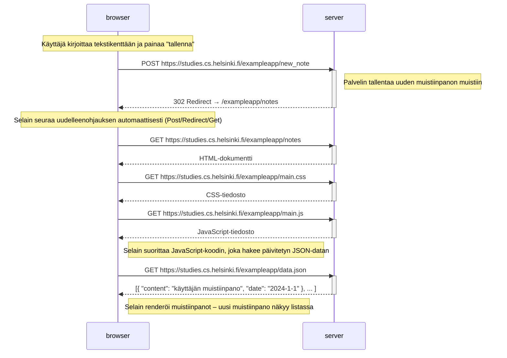

# Uuden muistiinpanon luominen – sekvenssikaavio

Kaavio kuvaa, mitä tapahtuu, kun käyttäjä kirjoittaa tekstikenttään ja painaa "tallenna" sivulla `https://studies.cs.helsinki.fi/exampleapp/notes`.

