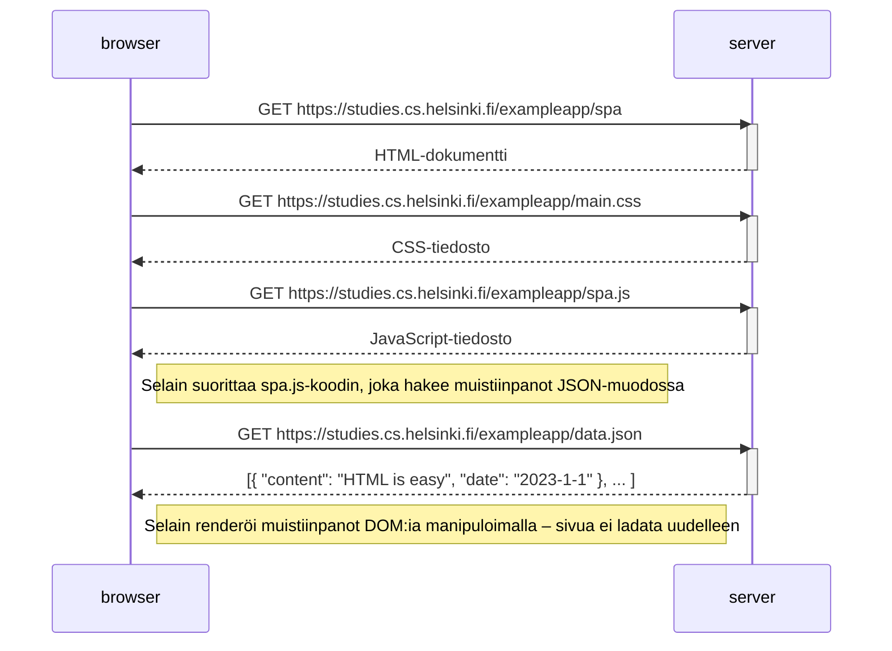

# SPA-sivun lataaminen – sekvenssikaavio

Kaavio kuvaa, mitä tapahtuu, kun käyttäjä navigoi osoitteeseen `https://studies.cs.helsinki.fi/exampleapp/spa`.

```mermaid
sequenceDiagram
    participant browser
    participant server

    browser->>server: GET https://studies.cs.helsinki.fi/exampleapp/spa
    activate server
    server-->>browser: HTML-dokumentti
    deactivate server

    browser->>server: GET https://studies.cs.helsinki.fi/exampleapp/main.css
    activate server
    server-->>browser: CSS-tiedosto
    deactivate server

    browser->>server: GET https://studies.cs.helsinki.fi/exampleapp/spa.js
    activate server
    server-->>browser: JavaScript-tiedosto
    deactivate server

    Note right of browser: Selain suorittaa spa.js-koodin, joka hakee muistiinpanot JSON-muodossa

    browser->>server: GET https://studies.cs.helsinki.fi/exampleapp/data.json
    activate server
    server-->>browser: [{ "content": "HTML is easy", "date": "2023-1-1" }, ... ]
    deactivate server

    Note right of browser: Selain renderöi muistiinpanot DOM:ia manipuloimalla – sivua ei ladata uudelleen
```
