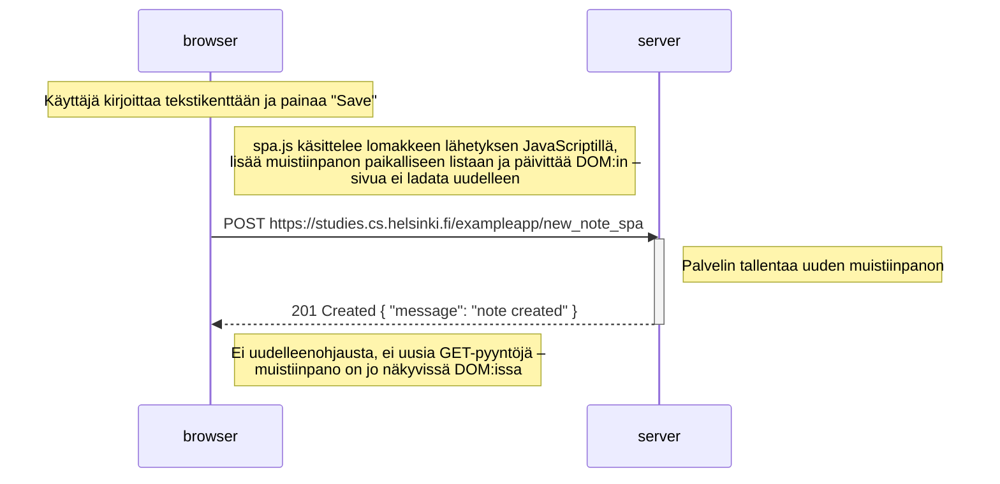

# Uuden muistiinpanon luominen SPA-versiossa – sekvenssikaavio

Kaavio kuvaa, mitä tapahtuu, kun käyttäjä luo uuden muistiinpanon single page app -versiossa.

```mermaid
sequenceDiagram
    participant browser
    participant server

    Note over browser: Käyttäjä kirjoittaa tekstikenttään ja painaa "Save"

    Note right of browser: spa.js käsittelee lomakkeen lähetyksen JavaScriptillä,<br/>lisää muistiinpanon paikalliseen listaan ja päivittää DOM:in – <br/>sivua ei ladata uudelleen

    browser->>server: POST https://studies.cs.helsinki.fi/exampleapp/new_note_spa
    activate server
    Note right of server: Palvelin tallentaa uuden muistiinpanon
    server-->>browser: 201 Created { "message": "note created" }
    deactivate server

    Note right of browser: Ei uudelleenohjausta, ei uusia GET-pyyntöjä –<br/>muistiinpano on jo näkyvissä DOM:issa
```
